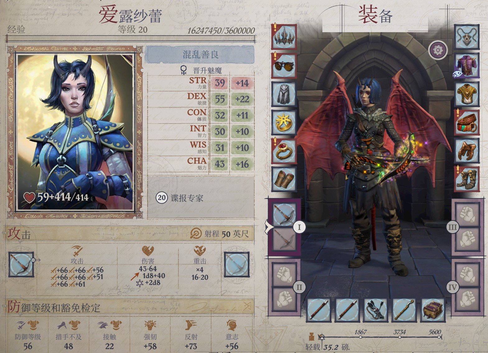
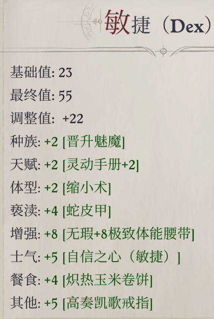
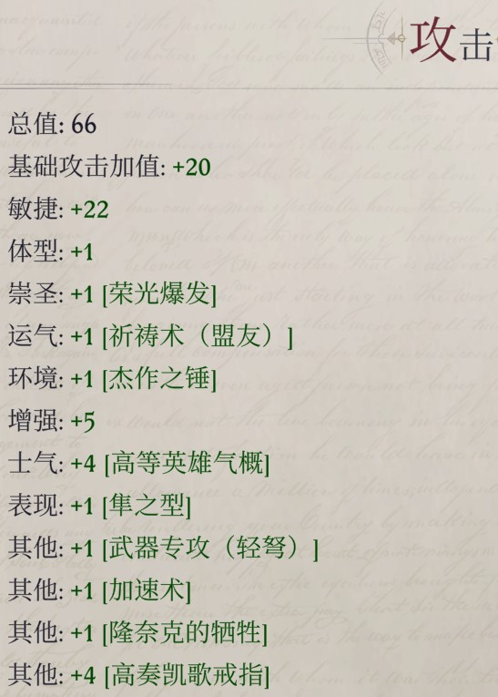
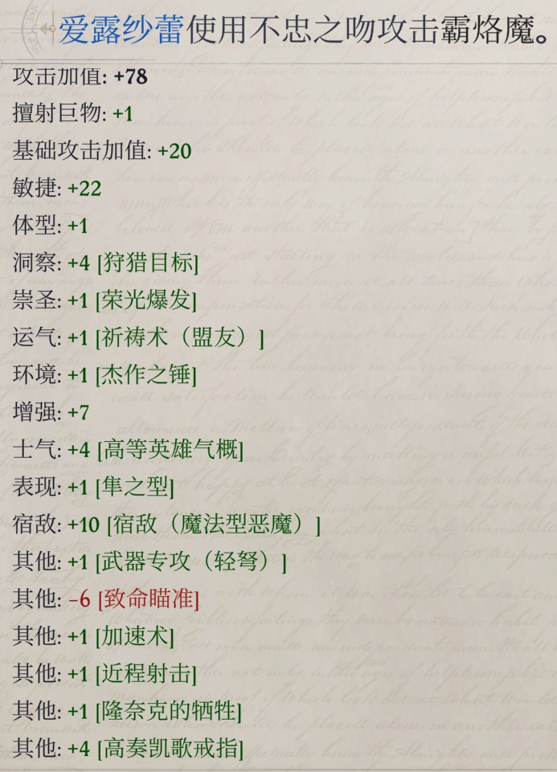
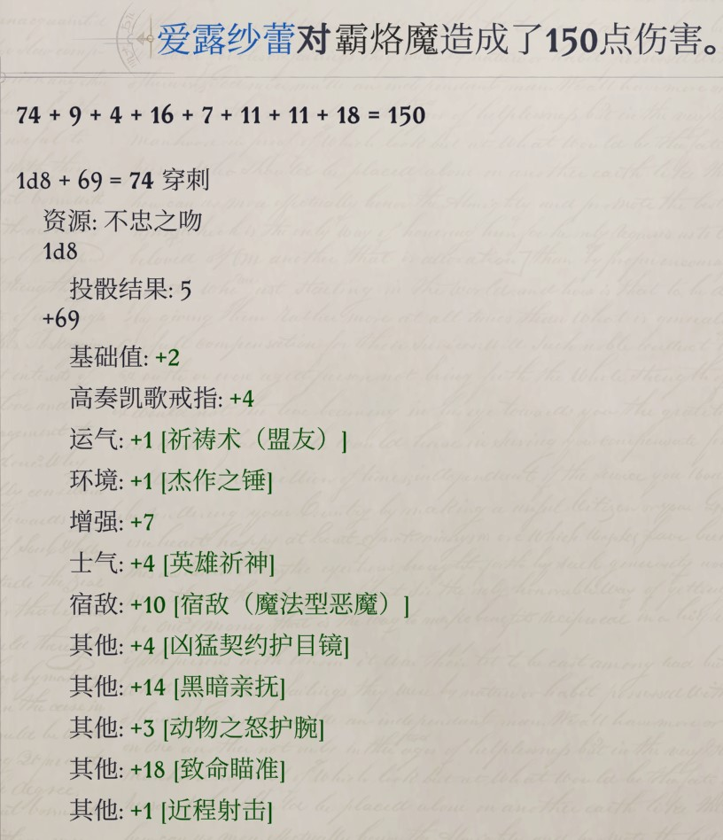
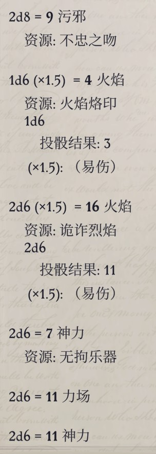
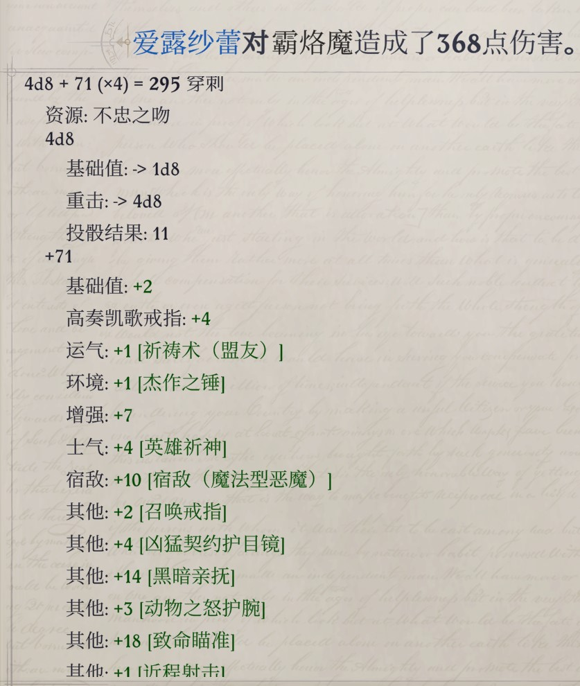
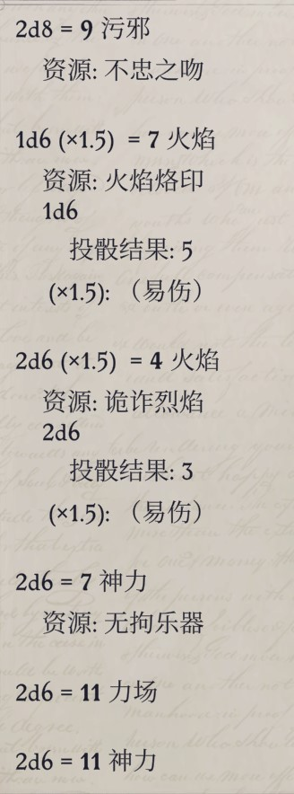

# **爱露莎蕾**

<center class="half">    
      
   
</center>


## 剧情奖励

- 初始自带【徳丝娜的庇护】：德丝娜守护着她的门徒。因女神的意愿，每当爱露纱蕾面临致命危机时，一阵神圣的蝴蝶旋风就会将她带到安全的地方。【也就是被打空血了不会变成尸体而是自动回到安全区】
- 完成善良阵营蜕变以后变成混乱善良阵营，且获得【徳丝娜之触】：爱露纱蕾被德丝娜赐予了神圣的幸运。她的豁免检定获得等于神话阶层一半的运气加值。【因此后期爱露莎蕾本身高魅力搭配圣武士的施恩（魅力调整值加到豁免检定上），加上这个buff给的豁免检定，后期全豁免都是拉满的】

## 谍报专家

- [x] 不公平难度实测

**加点方案**：20谍报专家

**介绍**：游戏官方给爱露莎蕾的定位类似于特工，正面常态作战能力不够强，更擅长打爆发、辅助队友和削弱敌人【实际上是因为测试版中游侠的异界生物宿敌过于强力，在正义之怒的主线剧本里几乎覆盖90%以上敌人；因此在正式版发售后，原版的异界生物宿敌惨遭四等分变成了现在不包括恶魔的异界生物宿敌，魔法型恶魔宿敌，杀戮型恶魔宿敌，蛮力型恶魔宿敌；---值得注意的是，其他所有的针对异界生物的能力比如异界生物破敌，对恶魔正常生效】；

- 谍报专家的【寻找陷阱】和【掩人耳目】，合计加0.5×职业等级的察觉、隐匿和哄骗检定。且爱露莎蕾各项属性值高，因此技能点多，天生就适合负责队伍里的技能检定（察觉、隐匿、哄骗）。
- 谍报专家4级能力只能选游侠羁绊，队友可以吃到5点宿敌加成，搭配狩猎目标（19级以后+4AB【洞察】）和大猎物手套（被狩猎目标指定的敌人陷入恶心，且-2AC），最优情况下游侠一共是20BAB+等效额外16点AB，给队友等效加了7点AB。

**在发挥以上功能的同时，还有以下几个玩法方向**：

- 兼职1级宫廷文豪（给个法师专长、还自带了制作卷轴的能力），点出【神话激励】：给队友加成<del>4~10</del> <ins>(新版本是3到6)</ins>智力和魅力【士气】。发挥更多的法系辅助作用。
- 使用DLC6以后新增的佯攻套（具体玩法和堆叠参考[雷吉尔BD](/Wotr/Wotr-BD-Tm8/Regill#佯攻机制)），在对抗BOSS的时候发挥更大的物理系辅助作用。这样完美适配谍报专家的能力【掩人耳目】：加0.5×职业等级的隐匿和哄骗检定；再加上游侠专长可以选技能专攻（沟通），相当于天生高魅力人且额外附带16点佯攻（哄骗）检定，爱露莎蕾的佯攻检定基本上是100%成功的。
- 特定的主角道途或者BD，堆资源和装备当输出。适合爱露莎蕾发挥的主角道途为 天使合书＞诡计大师 或者 诡计大师转后期道途＞灵使＞其他。

**BD思路**：

- 远程射手的优势是射程最远，击杀敌人/重击还能触发【分裂射击】打AOE，远程射手因为全程可以站桩打整轮所以在同等AB和单次伤害的情况下，输出效率极高（机制上基本上仅弱于大力哥和开大招的螳螂狂信徒）。弱势也很明显，就是基础伤害低，不吃夹击和圣战之刃加成所以AB低，主要属性分散，基本上吃不到借机攻击，给有限资源的情况下，会感觉用处不大。**所以远程射手想要玩的有存在感，就得堆资源和装备好好供着，把伤害和AB堆高**。
- 弩可以吃隼之型的加成，将基础重击倍率变成3倍，所以弩有精通重击以后基础重击属性是17-20 ×3，属于远程武器里的最顶级面板（可以当成近战里的斩矛），搭配<底线支援>（使用远程武器时，队友对自己30尺内的敌人发动借机攻击命中以后，自己可以对其发动一次攻击，每个敌人只能触发一次）+包抄（或者大力哥一人成军+抓准时机）+鸟哥突脸敌方后排射手的情况下，借机流非常猛，第三章即时制开近程射击后日常一轮10箭顺带给队友提供大量借机。
  - 轻弩后期用<轰烈>/<不忠之吻>。流程为<+1神圣轻弩>（第二章眷泽城掉落）、<+3幽冥觅心轻弩>（第三章说话武器升级）、<轰烈>（第五章伊兹城宝箱）/<不忠之吻>（第五章DLC3完成魅魔女王任务的奖励）/<暗影之吻>（第五章诡计大师道途帮助议会对抗魅魔女王的掉落）。
  - 重弩后期用<永寒>（第三章珍宝岛掉落）/<+5光能觅心重弩>（第五章说话武器升级）/<+5流血公正重弩>（第五章眷泽城商人购买）/<碎心>（+5超音觅心重弩，塑能系DC+2；第五章诡计大师道途帮助魅魔女王对抗议会的掉落）。流程装备为<落魄重弩>（第三章实验室，可以有BUG，鸣爆伤害不会随重击倍率提高）、<+3幽冥觅心轻弩>（第三章说话武器升级）、<永寒>/<+5光能觅心重弩>/<+5流血公正重弩>/<碎心>。弹跳重弩效果并未实装（更新日志说了修复，结果没有），挺可惜的。
  - <永寒>相当于自带多1次满BAB攻击，而且用标准动作射击也能多射1次，这次攻击可以重击可以附带偷袭，比多重射击的一箭要厉害很多。
- 新版本隼之型可以触发变化自如的加成，爱露莎蕾可以优先考虑变化自如提高属性，前期属性变高了，但是神话能力会变得比较紧张。
- 诡计大师神秘2可以反复变形说话武器来刷出灵巧附魔，让弩获得敏上伤，这样爱露莎蕾要学一个武器娴熟。

### 玩法

- 搭配聂纽神话3偏好延时的加点，解放了低等延时超魔权杖和保证高等隐形术以后，爱露莎蕾就可以全程把伤害拉满了，再搭配DLC6版本更新的法力珍珠恢复法术位，还能省下一个充裕施法。第三章开始，两个低等延时超魔权杖+6发识破命门，约等于常驻识破命门的偷袭骰。
- 关于体型法术：**要么不变体型，要么变巨**，13级以后一律缩小+伟岸雄姿保证高伤害。远程人有飓风之弓的情况下，变巨或缩小都是 2AB 和 1d6+1伤害 互换，这跟致命瞄准2AB换4伤害差不多。**因为远程中期缺伤害，所以保证打中的前提下尽量是都换成伤害**。
- 新版本在圣战之刃改版后（从以前的武器附魔变成了现在的人物状态增益），切换徒手然后让队友给圣战之刃，再切换回远程武器也能生效了，要是用了这套BUG。中期的远程输出会有一个巨大的改善。

### 属性和技能加点

- 4敏1魅（就是20级属性点加魅力），如果是诡计大师/灵使则可以加5敏

- 初始技能加点：灵巧、巧手、隐匿、察觉、沟通和神秘。沟通（非佯攻流）和神秘可以换成以下的技能

  - 点5级使用魔法装置，这样可以撕回声定位卷轴来无视敌人的复仇旋风、心灵屏障+高隐/移位术/镜影术。
  - 点满宗教，用来抄录隼之型等卷轴（神术用宗教检定，奥术用神秘检定）。

### 详细加点方案

```
--通用加点-----------
1近程射击（自带）
2【流派专长】：精准射击（自带）
3快速射击（自带）
5致命瞄准（自带）
6【流派专长】：多重射击（自带）
7集束射击（自带）
9精通先攻
10【流派专长】：精通重击（长弓/重弩）
11技能专攻（隐匿） ---不公平难度会在这里点出技能专攻（隐匿），堆到无BUFF力竭以后38隐匿（困难36，核心34），第三章大地图就100%不会遇到被随机野外遭遇突袭了
13武器专攻（长弓/重弩）
14【流派专长】：贴身射击（长弓/重弩）/精通精准射击
15包抄（远程点包抄虽然不能吃到包抄的+2AB加成，但是攻击被近战夹击的敌人，造成重击以后，近战也是可以借机的）
17超魔（法术延时）---首先是可以把视如仇寇法术延时到4环，而且也可以把识破命门之类的延时到3环。
18【流派专长】：精通精准射击/贴身射击（长弓/重弩）
19自选/抄录卷轴（有需求可以提前到13级，可以制作延时重压之刃、延时飓风之弓和延时隼之型等给队友或者主角使用）

--通用加点（佯攻流）-----------
1近程射击（自带）
2【流派专长】：精准射击（自带）
3快速射击（自带）
5致命瞄准（自带）
6【流派专长】：多重射击（自带）
7集束射击（自带）
9寓守于攻
10【流派专长】：精通重击（重弩）
11佯攻
13终结佯攻
14【流派专长】：技能专攻（沟通）
15远程佯攻 ---提前开启分享宿敌、开战后狩猎目标（标准动作）+视如仇寇（迅捷）+佯攻（移动动作）
17精通先攻
18【流派专长】：精通精准射击/贴身射击（重弩）
19超魔（法术延时）/包抄

--诡计大师道途加点，搭配一人成军/独行战术的大力哥，比如本网站的突变斗士兰恩----
1近程射击（自带）
2【流派专长】：精准射击（自带）
3快速射击（自带）
5致命瞄准（自带）
6【流派专长】：多重射击（自带）
7集束射击（自带）
9精通先攻
10【流派专长】：精通重击（长弓/重弩）
11精通精通重击（长弓/重弩）
13精通精通精通重击（长弓/重弩）
14【流派专长】：贴身射击（长弓/重弩）
15精通精通精通重击精通（长弓/重弩）
17超魔（超正常法术）
18【流派专长】：精通精准射击
19超魔（法术延时）/武器娴熟【前提是重弩玩法，且你学了神秘2，然后刷出了灵巧重弩--反复刷说话武器即可；主角诡计大师转传奇的话，可以神话6出神秘2阶，这样刷完武器嫖完诡计大师察觉2阶专长，再转传奇】

--19谍报专家1宫廷文豪【辅助向加点】-------------------
1近程射击（自带）
2【流派专长】：精准射击（自带）
3快速射击（自带）
5致命瞄准（自带）
6【流派专长】：多重射击（自带）
7集束射击（自带）
9技能专攻（隐匿）
10【流派专长】：精通重击（弩）
11宫廷文豪：余音绕梁、【额外法师专长】：超魔（法术延时），【法术】：绝不动摇+渐隐术
13精通先攻/包抄
15包抄/精通先攻、【流派专长】：贴身射击（弩）
17武器专攻（弩）
19额外演绎、【流派专长】：精通精准射击

================以下为旧版本=================================

--诡计大师道途加点【旧】----【这套加点是把远程当成借机攻击触发器了，实际上远程堆资源可以独C的】
1近程射击（自带）
2【流派专长】：精准射击（自带）
3快速射击（自带）
5致命瞄准（自带）
6【流派专长】：多重射击（自带）
7集束射击（自带）
9战斗反射
10【流派专长】：精通重击（长弓）
11抓准时机
13精通精通重击
14【流派专长】：贴身射击（长弓）
15精通精通精通重击
17超魔（超正常法术）
18【流派专长】：精通精准射击
19精通精通精通重击精通
```

**宿敌选择：**

爱露莎蕾加强宿敌已经选了一级魔法型恶魔了，所以后面为了满级加强宿敌是没得选的，只能一路走到黑，要不然主线里宿敌顺序是杀戮型恶魔（这些敌人一般有直闪或者反隐手段）＞不死生物（DLC里数量庞大）＞其他；

1级选人类，5级选魔法型恶魔、加强宿敌也是魔法型恶魔，之后加强宿敌都选魔法型恶魔，普通宿敌为（优先级不死生物＞杀戮型恶魔＞蛮力型恶魔）。

**神话专长和能力：**

神话能力备选：分裂射击＞~~充裕施法~~（多一些视如仇寇）＞领袖感召、扰乱射击、揭示弱点、偏好超魔（延时，如果聂纽有偏好延时，那爱露莎蕾就不太需要了，直接把低等延时超魔权杖拿过来用）、（高等）持久法术（非必要）、大法师护甲、变化自如

神话专长：精通先攻（神话）、精通重击（神话）、致命瞄准（神话）、快速射击（神话）

**神话专长和能力的点法很多**，我这里只提供两种点法：

- 【偏辅助加点】：1变化自如、2快速射击（神话）、3领袖感召、4精通先攻（神话）、5分裂射击、6精通重击（神话）、7屹立不倒、8致命瞄准（神话）、9揭示弱点/试射瞄准/擅射巨物/偏好超魔（延时）/巅峰元素（火--搭配诡诈烈焰手套和火焰烙印）；
- 【主输出加点】（也就是不出领袖感召）：1变化自如、2快速射击（神话）、3分裂射击 /充裕施法、4精通重击（神话）、5分裂射击 /擅射巨物/试射瞄准、6精通先攻（神话）、7屹立不倒、8致命瞄准（神话）、9揭示弱点/试射瞄准/偏好超魔（延时）/巅峰元素（火--搭配诡诈烈焰手套和火焰烙印）
- 【19谍报专家1宫廷文豪】：1变化自如、2快速射击（神话）、3神话激励、4精通重击（神话）/领袖感召（根据队伍里其他人是否会出领袖感召来选择）、5分裂射击、6精通先攻（神话）、7屹立不倒、8致命瞄准（神话）/精通重击（神话）、9揭示弱点/试射瞄准/擅射巨物/偏好超魔（延时）、10致命瞄准（神话）；
- 注：新版本有法力珍珠回复法术位，游侠不用学充裕施法了。多出来的神话可以考虑神话5左右出偏好超魔（延时），这样BUFF时间特别长。

### 弓和弩的伤害区别

有人想，用复合长弓会比重弩伤害高很多，毕竟弓比弩多了十几点力量调整值加成。那就上数据算一下吧。

- 第三章不考虑伟岸雄姿：复合长弓的力调额外加成5伤害，武器骰比重弩少2伤害。也就是说基础就差3点。
  - 力量为13+4增强+4变化自如 = 21（5）
  - 飓风之弓加成后重弩的武器骰：2d8
  - 飓风之弓加成后复合长弓的武器骰：2d6
- 第三章考虑伟岸雄姿（先缩小再伟岸）：复合长弓的力调额外加成7伤害，武器骰比重弩少4伤害。也就是说基础还是差3点。
  - 力量为13+4增强+4变化自如+6伟岸雄姿-2缩小术 = 25（7）
  - 飓风之弓加成后重弩的武器骰：4d8
  - 飓风之弓加成后复合长弓的武器骰：4d6
- 后期同理。灵使道途主角，满级神装的爱露莎蕾拉满就14力调，也就是说单次攻击比弩多了10伤害。
  - 但是永寒重弩的'多重射击'可以偷袭和重击（专长的多重射击不行），弩的重击概率20%，比弓的10%大，但凡这多出的重击概率额外触发一次重击+顺便触发分裂射击就远远超越了复合长弓。

### 装备参考

从左到右为获得/替换顺序，**粗体**为最终装备的备选，自行选择搭配。因为休息的时候是隐匿位置，所以务必拉满隐匿检定，第三章无BUFF+力竭状态下有38隐匿（困难36，核心34）以上就不会有随机野外遭遇战了。爱露莎蕾加树肤的时候，可以用笛拉梅尔盔甲+疾风弯刀，这样树肤也是满施法者等级了。

- 武器：
  - 最终弓：<**+1邪恶异界生物破敌弓**>（DLC3第三章的珍宝岛获得，DLC4第三章醋栗谷也可以购买），<**节律杀机**>（第五章骷髅商人）/<**神射手**>（第四章下城区）
  - 轻弩：+2神圣轻弩、**菲尼安轻弩**、**不忠之吻**（帮助魅魔女王击杀奈罕翠的奖励）、**暗影之吻**（击杀魅魔女王获得）、**轰烈**（第五章伊兹城）
  - 重弩：落魄重弩、**菲尼安重弩、永寒、+5流血公正重弩、碎心**（诡计大师道途帮助魅魔女王对抗议会）
- 头盔：风宗头盔，+N魅力头（休息的时候佩戴）、**黑暗亲抚**（第六章阈城，魅魔女王会给），
  - 宫廷文豪：鼓舞颂歌之帽（唱歌的时候给快速回复，可能有点用）

- 眼镜：**邪眼护目镜、凶猛契约护目镜**（灵使道途第三章庭院的炼金术士购买）、**奸徒眼镜**
- 披风：伪装斗篷、剥皮斗篷、**独狼斗篷、险隐**、视隐匿检定来更换，优先保证大地图的隐匿检定；
- 戒指：**射杀**（第三章兰恩/雯朵格剧情任务以后送的戒指：近程射击额外再加1AB）、**启明星戒指、骗徒戒指、灵魂之灾**
- 护腕：
  - 弓：次级神射手护腕、**神射护腕**、动物之怒护腕（变形效应以后+3AB和3伤害，这版本有BUG无条件叠加，AB不显示在战斗日志详细里，但是总值是加成了的）
  - 弩：**突袭护腕**（用识破命门触发，搭配菲尼安武器的觅心附魔，或者灵魂之灾转力场）、动物之怒护腕（变形效应以后+3AB和3伤害，这版本有BUG无条件叠加，AB不显示在战斗日志详细里，但是总值是加成了的）
- 项链：风之气息/底线支援（冬阳村石之心解谜奖励的项链：使用远程武器时，队友对自己30尺内的敌人发动借机攻击命中以后，自己可以对其发动一次攻击，每个敌人只能触发一次；搭配射杀+近程射击+弩会很好用），第四章可以换成**快速应敌护符**
  - 宫廷文豪：弗兰切斯特的魅惑之音（第五章圣教军合成，+10轮战歌，休息的时候佩戴）

- 盔甲：笛拉梅尔盔甲（第三章善猎神殿处获得，加树肤用的）、**部族斥候革甲**（第四章沃尔吉夫处购买）、**蛇皮甲**（第五章DLC3珍宝岛）
- 法袍：**重度护命衣**
- 腰带：+N力量敏捷腰带、**+6极致体能腰带**、**突袭者腰带**（有杰作之锤以后就可以换成其他的）
- 手套：**大猎物手套、精准手套（灵使道途第三章庭院的炼金术士购买）、诡诈烈焰**
- 靴子：**精灵之靴**（DLC3第三章的掉落，+5灵巧检定的鞋子）、**隆奈克的牺牲**（这个是敏系菜刀神装了，一般很难给到爱露莎蕾都是给主角的）、**缜密步履**（每轮第一次的远程攻击额外造成 1/2察觉技能等级的伤害，恶魔道途第四章特殊剧情掉落）
- 物品栏：低等延时超魔权杖×2（搭配识破命门），小魔鬼（第三章堆隐匿用）/旧魔典，远程超魔权杖×2（搭配视如仇寇），玫瑰刺弹药箭筒（每天20发，攻击附带2d8污邪伤害，DLC4醋栗谷商人处购买），炽焰弹药箭筒（每天20发，攻击附带1d6火焰伤害，DLC4醋栗谷商人/旅行商人等地方购买）、法力珍珠

### 远程伤害来源

以第三章13级重弩为例：

- 武器骰：重弩1d10，需要远程输出就是缩小以后再伟岸，变成4d8
- 附魔：说话武器1d8力场，增强加值3
- 法术：意气风发2【士气】，识破命门3d6偷袭，太阳印记4d6神力（天使）
- 装备：突袭护腕1d6，召唤之戒2，精准手套1d6和凶猛契约护目镜4（灵使）
- 专长：致命瞄准8，近程射击1
- 箭筒：玫瑰刺弹药箭筒（每天20发，攻击附带2d8污邪伤害），炽焰弹药箭筒（每天20发，攻击附带1d6火焰伤害）
- 职业能力：宿敌+6
- 不考虑道途，**合计伤害为**：4d8+16+3d6偷袭+1d8力场+1d6突袭护腕 +6宿敌 +2d8污邪，单箭期望伤害52.5 + 【6宿敌 +2d8污邪】（这两个为特定情况额外输出）
- 后期伤害能偷袭的话，一箭100还是有的，重击以后300多轻轻松松【配合各种道途加成，伤害会更恐怖】。不会堆伤害的话可以考虑不带远程，毕竟射程本身就是占摸，基础攻击范围大为了平衡自然要限制基础伤害。

### 后期面板参考

灵使道途主角的神装爱露莎蕾参考（神话10打阿瑞露之前），弓箭手在回合制则尽量保证一轮总伤害能击杀敌人（一轮射完杀不死敌人就没啥存在感和意义了），对抗可以集火的BOSS或精英单位能秒掉最好，秒不掉就尽量补一下伤害。

- 使用灵动手册+2，隆奈克的牺牲，玉米饼，目前的体型是先伟岸雄姿再缩小，武器是轻弩<不忠之吻>。

- 无拘乐器和神圣长枪的BUFF不是常驻的，一般来说不给爱露莎蕾无瑕+8体能腰带和高奏凯歌之戒，不过这两个装备但是对伤害数字影响不大懒得再做差分截图了【这里没有触发独狼斗篷的+3远程伤害，回合制的话配合五尺快步基本上能稳定触发】。

<center class="half">    
      
   
</center>

#### 面板AB和战斗中AB

<center class="half">    
      
   
</center>

#### 非重击伤害

以下伤害截图还有偷袭骰5d6的部分没有截进来

基础值2是快速应敌护符的伤害，7增强是 5增强+2破敌带来的额外增强，2d6力场是【破敌】的额外伤害，2d6神力是索希尔善良领域能力---【神圣长枪】的神圣附魔伤害。

<center class="half">    
   
   
</center>

#### 重击伤害

以下伤害截图还有偷袭骰5d6的部分没有截进来

<center class="half">    
      
   
</center>
