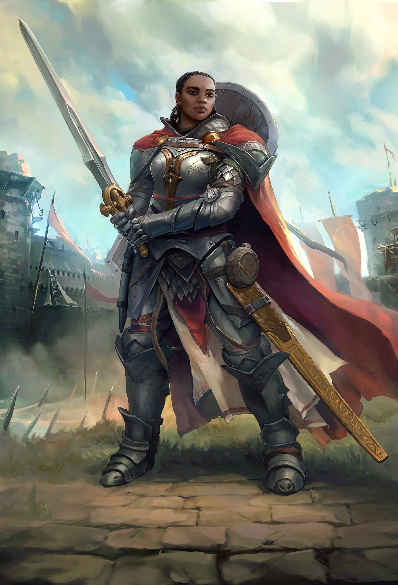

# 席拉



**特殊说明**：作为初始队友，**兰恩/雯朵格+席拉+科米丽雅**，这三者的BD**跟主角BD相互制约**。必须要有人出动物或者当T，最好要有一个大力哥，其次要有一个远程射手。而科米丽雅本身最好保持纯职业获得前期最强的辅助能力。主角肯定不会为了队友屈尊去玩T。

因此：

- 如果席拉当T的话，主角或者兰恩最好是大力哥。
- 如果兰恩/雯朵格出动物伙伴或者自己当T，那么席拉就可以当大力哥。

## 剧情奖励

- **独有能力**：第五章做完席拉任务以后，回到眷泽城兵营处跟席拉对话【注：必须你主动去找席拉对话】。对话完成后，席拉会获得能力【护卫友伴】：消耗圣疗次数来给全队增加AC【盾牌加值】，数值相当于席拉的魅力调整值，每个圣武士等级持续1轮。
- **剧情任务相关的最终装备掉落**：杰作之锤（加2次满BAB攻击，且攻击检定+1【环境】---主要是用这个效果，持续1小时，每天3次）

## 传统盾T

- [x] 不公平难度实测

**方案**：14圣武士1传统武僧1受诅巫师3突变斗士1原怒者

**介绍：**重装战士，可以无视大部分敌人攻击和法术控制，打BOSS的辅助能力强。这个BD不是纯T，不需要洗点，前期重甲剑盾，高AC当主T，中期速出正义烙印打BOSS。有屹立不倒，就算打BOSS的时候AC不够，硬刚两轮也能配合队友把BOSS秒了。

**BD思路**：既然开局点出了闪避和盾牌专攻，说明这就是官方给的T，转成其他玩法就白亏两个专长，因此就顺着这个思路把席拉作为主T来构筑。加上后期剧情奖励的【护卫友伴】关联圣武士等级和魅力，所以就以圣武士为主职业。后期才获得的【护卫友伴】适合用于主线通关以后打数值爆炸的DLC1。

**更新时间**：2024/9/7，席拉的盾击流BD，流程中的AC、AB和伤害都是比转无甲的高。

### BD变体思路

- ~~1传统武僧可以换成1师范（比传统武僧少2意志豁免，但是可以换取勇气颂歌；但是前期才两轮没啥意义，但是前期席拉的2意志还是有点用的），后期搭配余音绕梁+神话激励也不错，就是次数略少需要搭配装备，然后得花费动作去唱歌~~。
- ~~第三章可以考虑兼职1宫廷文豪，再学余音绕梁，配合神话激励使用，第三章神话4可以给队伍+6智魅，加成也不低。同时可以参考14圣武士2活体1鳞拳1巫师1先知1原怒者的专长加点和玩法，不出盾击流，点出结盟施法者等，更偏向辅助~~。
- ~~队伍里有歌者的话，1原怒者可以换成1宫廷文豪，无限狂暴换成神话激励~~。

### 属性和技能加点

- 20级共计+5魅力；

- 只加3灵巧，主要加世界、察觉和沟通（沟通加到5级左右，其他队友入队了可以换其他的，比如巧手、世界、宗教、5级使用魔法装置）。
  - 席拉在驻扎的时候，一般是当成守夜人或者做饭的，所以察觉和世界很重要。
  - 席拉是T，需要一直在队伍前方探路，察觉是必不可少的，越高越好。

### 玩法思路

- 关于不公平难度**序章过渡**，席拉3级后可以先拿精制品大砍刀（不开防御式攻击），让雯朵格拿花豹当T--[BD](Wotr/Wotr-BD-Tm8/Wenduag#序章过渡加点)，科米丽雅拿避灾或者邪眼均可。出了序章拿上霜护就能轻松抗线了。
- 前期保证AC的情况下，速出5圣武士，拿到一环的两个法术位【天堂面纱和圣能面纱，各持续20分钟；】，且拿到武器盟誓 - 锐锋；7圣武士则拿到2环，可以给自己放施恩。
- 保证BD基本强度的情况下，最大程度地保留圣武士等级。
- 前期重甲剑盾，2级兼受诅巫师拿知命（会玩的推荐选知命，不公平难度也推荐知命，新手玩则不推荐）或者跛足。席拉前期AC构成里有4点是要A出来才有的，有恍惚第一轮打不出来少4AC，不如拿跛足获得免疫疲劳（这样可以随便一直开狂暴了，省心很多）。
- 神话2拿到神话重甲（耐受）以后，先用中甲过渡（不公平难度可以用<自然的惊愕>，军需官处购买），然后就穿秘银重甲<虫壳甲>（秘银重甲吃神话中甲和中甲专攻的加成），~~最后如果要点出神话中甲回避的时候再考虑换回中甲~~。【新版本第二章神话2以后，比以前的BD高出4点AC，对抗天生武器敌人再高2点】
- 第四章群岛，做了泰坦石的任务以后，有个+2魅力【天赋】的书，如果主角不是特别需要魅力的职业（目前天赋书和灵魂魔药的加值可以叠加），可以把这个书给席拉吃。
- **提供一个席拉“单杀”取乐的黑暗的方法**，利用辟邪斩+反伤BUFF+~~灵魂之灾转力场~~，配合屹立不倒即可实现超级反伤（注意要有直闪或者先手才行，BUFF少了不一定稳）。
  - 基本装备和BUFF如下：<风暴领主的决意>（第三章黑水获得）、<曙光护盾>（圣武士四环）、<生命烈焰>（第三章索希尔任务：根除者营地获得）、<圣洁金光>（第三章午夜神庙：白风斗篷）
  - 额外反伤还有：天使道途的<御魔之盾>和<太阳印记>、卷轴<荆棘之躯>、卷轴<吸血影障>、御衡者复仇法令、永饥寿衣
  - 基本的四段反伤就能两轮反死了，如果主角是天使合书之类就更快了。
    - 注：这个套路在灵魂之灾改版以后就不行了

### 前期AC

- **第一章**：+1炽焰战锤、<损害长剑>，然后一直用弯刀<骤然巨力>
  - 5级通用AC为42，极限AC为44（对抗恶魔或者不死生物）/45（对抗邪恶人类+辟邪斩）/47（对抗恶魔或者不死生物+辟邪斩），对抗第一章99%敌人是绰绰有余了（别忘了还有避灾+镜影+移位，甚至是操纵亡者垫刀）
    - 基础：10
    - 盔甲：9 = 8半身甲+1盔甲增强；这里可以买个更好的盔甲额外+1敏调（但是没必要了）
    - 盾牌：7 = 4护盾术/2重盾+2盾牌增强+1盾牌专攻；护盾术靠队友做卷轴
    - 剩余的面板加成：12 = 2偏斜+2树肤+4冻皮霜护+1闪避+1加速术+1体型+1骨拳术
    - 战斗中加成：6 = 4防御式攻击+2【崇圣】（圣武士法术-有卷轴，对抗邪恶异界生物或者不死生物）+5辟邪斩（要减去原本的2偏斜）

- **第二章**：武器用麻风病的微笑下面的<心灵穿刺者>，眷泽城换<疾风弯刀>。
  - 7级极限AC为59，对抗第二章敌人是绰绰有余了（别忘了还有避灾+镜影+移位，甚至是操纵亡者垫刀）
    - 基础：10
    - 盔甲：12 = 6盔甲+2盔甲增强+1盔甲专攻+3敏调
    - 盾牌：7 = 4护盾术+2盾牌增强+1盾牌专攻
    - 剩余的面板加成：20 = 7偏斜+3树肤+4冻皮霜护+1闪避+1加速术+1体型+1骨拳术+2莎恩芮战裙
    - 战斗中加成：10 = 4防御式攻击+2【洞察】（盔甲附魔，对抗天生武器）+2【崇圣】（圣武士法术，对抗邪恶异界生物或者不死生物）+2【士气】（来源是生命守卫护符，对抗不死生物）/2【表现】（迫降护腕，对抗飞行单位）
  - 神话2以后，额外获得装备盔甲加成，8级至少为4，如果加法师护甲的话（可以防御土元素/憎美魔之类的粉碎盔甲）变成6。
    - 8级神话2的极限AC为59+6 = 65
- **第三章**：武器选择<疾风弯刀>或者长剑<攻守平衡>（象牙迷堂处获得）【持盾情况下，额外+3AB】配重盾，搭配席拉最爱食物【可以给全队+1AC，且席拉会额外+3AB】，基本上属于超高AB+高伤害（圣战之刃+武器盟誓公正+阿罗登剑鞘+神话中甲强攻）+高AC+超高豁免，这个时候基本上是乱杀的。更推荐用基础重击范围18-20的武器，这样重击率高适合借机流。然后遇到好武器就换。
  - 11级极限AC为80，拜托别跟我说AC不够了。
    - 基础：10
    - 盔甲：24 = 9盔甲+3盔甲增强+1盔甲专攻+3敏调 + 6或8装备盔甲（看你加不加法师护甲）
    - 盾牌：8 = 4护盾术+3盾牌增强+1盾牌专攻
    - 剩余的面板加成：26 = 7偏斜+5树肤+4冻皮霜护+1闪避+1加速术+1体型 +1骨拳术+1幸运骰子 +3袍泽头盔+2莎恩芮战裙
    - 战斗中加成：12 = 4防御式攻击 +2【崇圣】（圣武士法术，对抗邪恶异界生物或者不死生物）/6【崇圣】（阿罗登剑鞘辟邪斩）+2【士气】（来源是生命守卫护符，对抗不死生物）/2【表现】（迫降护腕，对抗飞行单位）
- **第四章**：学了异种武器擅长以后，用<夜空闪>，先攻就是天，能提前给正义烙印才是王道。或者感觉先攻够用了，就拿弯刀，中后期有弯刀好装备<火风暴>、<信仰承载者>和<破晓花吻>等。

### 详细加点方案

```
--通用加点1-------- 这套配合席拉的背景（扒手），序章出门就有2扒手+1敏调+4野兔+4精通先攻 = 11的先攻，基本上很容易抢到先攻
1圣武士：闪避、盾牌专攻（自带）
2受诅巫师：冻皮【巫术】、魔宠【野兔】、【诅咒】：知命、法术选择缩小术/防护恶心和法术护甲
3传统武僧：精通先攻、鹤形拳
4圣武士
5圣武士：包抄
6圣武士
7圣武士：盔甲专攻（中甲）---此时可以先穿灰兵营掉落的胸甲（+2的但是很便宜的那个）
8圣武士
9圣武士：超魔（法术延时）
10圣武士
11圣武士：盾击
12圣武士
13圣武士：双武器战斗 ---基础敏捷不够没事，用敏捷腰带就可以点专长
14圣武士
15圣武士：盾牌大师 ---此时才开盾击（之前的减值太高了，除非你第三章先买一个轻盾过渡，而且收益不高）
16圣武士 
17突变斗士：猛击终结、精通重击（弯刀）
18突变斗士：盾牌辟矢（每轮触发一次，让命中的远程攻击无效化，可以防御敌人20级战士弓的天然20骰+自动确认重击）
19突变斗士：猛力攻击/精通双武器战斗
20原怒者：天界血脉——拿天使之击

感觉法术时间不够（低等延时超魔权杖不够），也可以把精通/高等双武器之一换成超魔（法术延时）

--主角为诡计大师-------- 这套配合席拉的背景（扒手），序章出门就有2扒手+1敏调+4野兔+4精通先攻 = 11的先攻，基本上很容易抢到先攻
1圣武士：闪避、盾牌专攻（自带）
2受诅巫师：冻皮【巫术】、魔宠【野兔】、【诅咒】：知命、法术选择缩小术/防护恶心和法术护甲
3传统武僧：精通先攻、鹤形拳
4圣武士
5圣武士：包抄
6圣武士
7圣武士：盔甲专攻（中甲）
8圣武士
9圣武士：精通重击（弯刀）
10圣武士
11圣武士：超魔（超正常法术）
12圣武士
13圣武士：精通精通重击（弯刀）
14圣武士
15圣武士：精通精通精通重击（弯刀）
16圣武士
17突变斗士：盾击、双武器战斗
18突变斗士：盾牌大师
19突变斗士：猛击终结
20原怒者：天界血脉——拿天使之击
```

**圣疗选择：**
疲劳、眩晕、力竭、震慑，看自己缺什么免疫和解什么状态的法术就选什么。

**诅咒选择：**
跛足或者知命

**武器盟誓和坐骑选择：**
武器盟誓，14级圣武士刚好可以同时出神圣+公正 或者 光能（等效AB很高的，第四章和第三章某些地图特别好用）

武器盟誓用法：点出精通重击之前，~~只考虑使用锐锋~~（目前有砥砺刀锋，可以直接用增强加值或者神圣/公正）；点出精通重击以后，就用神圣/公正/光能；

**原怒者血脉选择：**
天界血脉——拿天使之击

**神话专长和能力：**

神话能力：常备不怠=屹立不倒＞大法师护甲=无穷辟邪斩=充裕施法，持久法术=高等持久法术，引领打击

神话专长：精通重击（神话）、精通先攻（神话）

**神话专长和能力的点法很多**，我这里只提供1种点法：

- 1屹立不倒、2神话盔甲专攻（中甲耐受）、3常备不怠、4神话盔甲专攻（中甲强攻）---如果可以的话此时尽量拿觅心武器、5大法师护甲、6精通先攻（神话）、7引领打击/无穷辟邪斩、8精通重击（神话）/神话盔甲专攻（回避）、9无限狂暴、10神话盔甲专攻（回避）/精通重击（神话）

### 满级神话9面板

**不考虑主角道途的加成**，袍泽头盔，腰带+6极致体能，项链出双入对，眼镜残缺诡术师，吃炽热玉米卷饼和魅力书（主角不需要魅力的情况下），用伟岸雄姿；

- **面板AC为** 95 / 104（护卫友伴） = 10基础 + 13大法师护甲 + 5盔甲增强 + 1盔甲专攻 + 16装备盔甲（神话中甲，计算大法师护甲和盔甲护腕的加成可以最高到18以上；没BUG也有9，影响真的不大） +6敏捷 +2盾牌/11护卫友伴 +5盾牌增强 +1盾牌专攻 +13天生防御（冻皮、霜护、伟岸雄姿、诱变剂、骨拳术）+5天生防御增强（树肤）+7偏斜（无瑕+7防护戒指）+1闪避+3士气（袍泽头盔）-2体型+1加速术+2环境（出双入对）+2洞察（预警）+1结界大师护符+ 3【运气】（刺绣手套）
- **战斗中的AC为**  110 / 121 = 104 +4防御式攻击（鹤形拳）+2崇圣（天堂/圣能面纱/金鹰之魂）/11崇圣（阿罗登剑鞘+辟邪斩）+2其他（善念僧袍）-2狂暴
- **先攻为** 30（+5）（+4） = 2扒手+6敏调+4精通先攻+4野兔魔宠+9精通先攻（神话）+5领袖感召（+5夜空闪）（+4知命）

- **面板AB为** 48 = 19BAB+15力量+3【运气】（神圣恩典）+5增强+4【士气】（英雄祈神）+1【加速术】-2【体型】+2环境（出双入对）+1武器专攻，主手武器可以自己附魔光能（相当于4、8、12甚至更高的AB）
- **战斗中的AB为** 62+N+11【辟邪斩】= 48+2增强【破敌】+2【表现】（善念僧袍）+2【洞察】（剔肉盾）+N【常备不怠】+6【狂暴+<暴力呼召>+<嗅血斗篷>】+4【包抄和夹击】+11【辟邪斩】-2防御式攻击，后期AC足够可以关闭防御式攻击。

### 常用法术选择

祝福武器、神圣恩典、天堂面纱、圣能面纱、施恩、勇武灵光、金鹰之魂、轰鸣击、高等天使之貌、圣剑术

### 装备参考

从左到右为获得/替换顺序，**粗体**为最终装备的备选，自行选择搭配。

- 武器（点出精通重击之前可以根据需求替换，长剑重击范围小了强度比较低）
  - **弯刀**：骤然巨力、疾风弯刀、火风暴（第三章关底BOSS掉落）、信仰承载者（第四章上城区）、**破晓花吻**（善良版，第五章无间囚牢）
  - 长剑：辉光、损害长剑、攻守平衡（第三章象牙迷堂）、神圣狂热者之怒（第四章活畜市场商人）
  - 细剑：心灵穿刺者（第二章麻风病人的微笑地下）、温柔之触（第二章眷泽城）、+2神圣细剑（第三章眷泽城商人）、奥法凝结之心（冬阳村）、拦截者（第四章活畜市场商人）、惊异冷针（第五章科米丽雅个人任务）
  - 穿甲剑：机敏之刃（第二章军需官）、蚀身之锋（第三章绿门堡）、**夜空闪**（第四章活畜市场商人）、**位面抹灭者**（第五章旅行商人的异国商品）+
  - ~~战斧~~：**坟中歌者**
  - ~~手斧~~：**坟中歌者、调停者**
  - **评价**：破晓花吻重击提供4AB和额外一次满BAB攻击，整轮攻击输出非常稳定；夜空闪给5先攻，不公平难度下先手权代表生命；~~坟中歌者基础重击倍率多了1倍而且还能无视一次麻痹、恍惚、震慑、石化和纠缠状态，席拉本身豁免就很高，只怕大失败，用坟中歌者就相当于可以无视大失败带来的震慑和石化秒杀了。调停者基础重击倍率高，而且重击以后可以让敌人措手不及，后期整轮攻击输出非常稳定~~。

- 盾牌：+2秘银重盾、神圣保护者（第二章猎心营地）、卫士盾牌（第三章DLC3珍宝岛）、凯旋正午（第三章圣教军合成）、焦黑屏障（第四章战斗极乐角斗场）、**希望使者不朽的爱**（第四章巴弗灭）、**剔肉盾**（无间囚牢）、**统御宣言**（无间囚牢）
- 头盔：+N魅力头环，+N极致精神头环（休息的时候佩戴用于做饭），守墓人头盔（第二章眷泽城），**风宗头盔、袍泽头盔**（第三章实验室）
- 眼镜：**残缺诡术师**（第三章DLC3的珍宝岛）
- 披风：+N抗力斗篷，**嗅血斗篷，暴力呼唤**（第四章活畜市场商人）
- 戒指：**霜护**，**无瑕+7防护戒指**（DLC1完美存档的奖励），**反射闪避戒指**（不公平难度下必须），**奈罕翠勇气之戒**（第四章活畜市场，揭破商人骗局即可获得；受到远程攻击+2AC，加10移速，不需要被远程武器击中即可触发）
- 护腕：**迫降护腕、+N防御护腕**（搭配神话中甲耐受的装备）
- 项链：**出双入队**（第三章牧师和法师塔）
- 盔甲：+2半身甲、自然的惊愕、虫壳甲、**+N秘银全身甲（AC最高）、不倦斗士胸甲（第五章圣教军掉落，免疫疲劳和力竭）、巨熊胸甲**
- 法袍：轻丝袍、大学士长袍（+3知识和学识检定，休息的时候佩戴用于做饭）、**善念僧袍、假死长袍**
- 腰带：+N属性腰带、**慑人巨力、蜥蜴尾、+6极致体能腰带**
- 手套：使节手套（+5世界检定，休息的时候佩戴用于做饭）、**刺绣手套**
- 靴子：**脱缰之靴**（行动自如）、**根语者之靴**（给30尺盲视）、**无拘无束之靴**（行动自如和10移速）、**深渊行者**（对抗恶魔+1AC）
- 物品栏：镜影术魔杖（岱兰任务-天堂之缘宝箱）、阿罗登剑鞘、（低等）延时超魔权杖、幸运骰子、法力珍珠