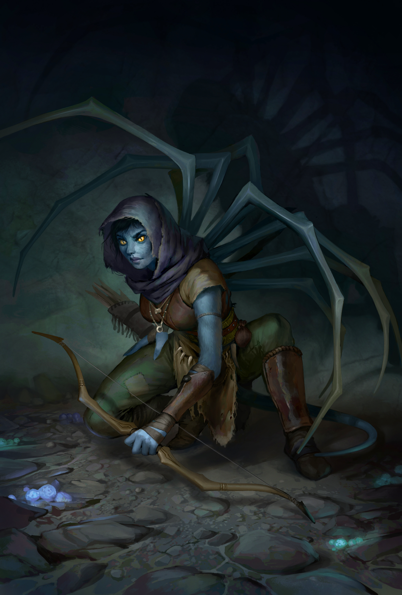

# **雯朵格**



**特殊说明**：作为初始队友，**兰恩/雯朵格+席拉+科米丽雅**，这三者的BD**跟主角BD相互制约**。必须要有人出动物或者当T，最好要有一个大力哥，其次要有一个远程射手。而科米丽雅本身最好保持纯职业获得前期最强的辅助能力。主角肯定不会为了队友屈尊去玩T。

因此：

- 如果席拉当T的话，主角或者兰恩最好是大力哥。
- 如果兰恩/雯朵格出动物伙伴或者自己当T，那么席拉就可以当大力哥。

## 剧情奖励

- **独有装备**：<萨瓦米勒克之脊>（+5恶毒复合长弓；且持用者命中目标时，目标将被腐化，所有属性值承受-2减值。这些减值不与自身叠加，此为诅咒效应）
- **罗曼线奖励**：主角获得【混种人的祝福】：你免疫毒素、电击、即死效应。此外，每当你以近战攻击命中敌人，该敌人必须进行强韧豁免检定（DC等于10+角色等级+魅力调整值），失败将承受一个永久负向等级，每个敌人最多承受10个负向等级。

## 序章过渡加点

**注**：仅限不公平难度下比较需要，这个过渡加点适用于席拉后续当T，兰恩大力哥的玩法。主角为法师的话序章会更强。

- **思路**：遇到混众人酋长时不展示天堂之光，让雯朵格入队打序章，然后打完序章BOSS以后选择带兰恩，因此完全不用考虑雯朵格后续BD。
- **方案**：1战士+1大盗+1协同猎杀者【花豹+好伙伴专长】，靠动物之力+分享研究目标，可以在序章培养出一个非常高AB和AC的花豹。

## 极恶弓手

**方案**：1战士4大盗10杀手3醉拳大师1先觉斗士1可选兼职

- 可选兼职（目的是为了免疫疲劳）：双重诅咒先知（通用），受诅巫师（诡计大师）；
- 如果主角是天使道途或者打算把不倦斗士中甲给雯朵格，则最后一级加点随意

<details>
  <summary>一个有点意思的基于BUG的扩展加点（点此显示）</summary>
  <p>
    可选兼职可以选择地卜师，配合萨瓦米勒克之脊,每次攻击都能触发【地相术】---相当于每次攻击附带30尺范围9d6伤害的AOE。
    【注：此时就不要学无穷狂暴了，因为狂暴以后无法施法，触发不了地相术】
  </p>
</details>
**更新日期**：2025-8-8

**介绍**：这个BD非常符合雯朵格本性残忍的画风，一次攻击附带数种属性伤害（每次攻击造成-2敏-2力量-1体质；腐化全属性-2；错乱之创降低敌人AC，解除敌人的BUFF；弱化创伤降低敌人的DR和能量抗性）。靠偷袭不断削弱敌人也很符合雯朵格猎人的背景。强度绝对够高，打不公平难度也是绰绰有余了，尤其适合主角是魔武双修的天使先知的队伍。

### BD思路

1. 序章2级出1大盗拿强袭要害和要害打击（7级之前都可以右键自动使用要害打击），配合3级的熟练偷袭者，可以打出惊人的输出。基本上都是一箭两箭就能击杀敌人。因为前期伤害全靠机制，根本没有降低AB的专长（致命瞄准和快速射击等），所以前期命中率也非常惊人。
2. 因为物理远程的相对强势期就在6BAB，此时有快速射击和多重射击就能一轮五打，因此后续不可能主升中BAB成长的大盗，因此选择同样依靠偷袭的满BAB成长杀手，速出杀手的10级进阶天赋。
3. 已经有1大盗和10杀手的等级的情况下，补3级大盗，收益补3级杀手收益更高，可以多拿一个错乱之创，也可以借助杀手的进阶天赋来点出游荡者的进阶能力。
4. **补1级先觉斗士和3级醉拳大师**：通用的非守序感知人在后期堆数值的办法。先觉斗士狂暴正好也是唯一一个可以对远程武器加AB的狂暴。
5. **怠惰打击**：降低体质的效果是瞬时的，同时降低当前血量和血量上限（每1体质调整值提供HD的血量）。也就是说打14HD的敌人，降2体质就相当于降低14血，约等于每次攻击额外造成7伤害。
6. **解除**：这个能力也会解除部分自己给敌人上的控制效果，要是队伍靠控制的话，建议不出解除。
7. 满级以后职业额外AB为19BAB+4错乱之创+8炼金+3研究目标+1武器专攻-5致命瞄准+2凝神狂暴+2暴力呼召+2神射护腕+2洞察 = 38，

### 属性和技能加点

- 4敏，最后一点任意，主角是诡计大师和灵使道途也可以加敏捷。
- 主加隐匿，次巧手和察觉。有撕卷轴需求就点5级左右使用魔法装置

### 玩法思路

1. 序章和第一章基本上就靠要害打击，需要措手不及就让法师给雯朵格放渐隐术。

   - 3级拿复合长弓的要害打击伤害是2d6+1近程射击+1研究目标+2d6偷袭骰+4d6强袭要害+3力调 ≈ 33，缩小以后再降低3伤害+2AB
   - 5级拿到+2复合长弓的要害打击伤害是2d6+1近程射击+1研究目标+3d6偷袭骰+6d6强袭要害+5力调 +2增强 ≈ 48，缩小以后再降低3伤害+2AB

2. 前期因为是靠要害打击，根据情况来决定是否需要缩小；第二章开始就不用要害打击了，靠整轮攻击来打输出，这个时候缩小就完事了；第三章以后就缩小+伟岸 或 伟岸+缩小，根据能否打中来决定。

3. 在第二章以后要害打击基本上没啥用了，7级以后直接靠队友给的高等隐形术打整轮攻击即可

   - 7级单次攻击伤害：1d6+1近程射击+1研究目标+3d6偷袭骰+4力调+2增强+4致命瞄准 ≈ 26
     - 整轮5打，共计伤害26×4+13 ≈ 117；
     - 如果想用远程圣战之刃的话，就在此基础上额外增加10+10d6 = 45。【不能合法获得圣战之刃加成，也是远程人全程相对近战弱势的一大根源】

   - 9级单次攻击伤害：1d6+1近程射击+2研究目标+4d6偷袭骰+4力调+2增强+6致命瞄准 ≈ 33

4. 因为是靠偷袭的职业，所以粉碎防御该出还是要出，加上13级以后专长可以出更宝贵的进阶天赋，所以只能11级左右点出来。

### 详细加点方案

```
--通用加点-----------
1战士：精准射击、近程射击（自带）
2大盗
3杀手：熟练偷袭者
4杀手：【杀手天赋】——战斗特技：武器专攻（长弓）
5杀手：致命瞄准 ---等7级再开，不打整轮的话收益太低
6武僧-醉拳大师：精通先攻
7杀手：多重射击，【杀手天赋】——战斗流派专长：弓术——快速射击
-----注：先随便选一个专长，进入杀手天赋界面选好快速射击，然后回来选择多重射击
8杀手
9杀手：精通重击（长弓）、【杀手天赋】————弱化创伤
10杀手
11杀手：炫目武技、【杀手天赋】————粉碎防御
12杀手
13杀手：额外杀手天赋——野兔魔宠、【杀手天赋】：技能专家（隐匿和巧手），这样第三章大地图行军的隐匿检定就稳了
14大盗：【游荡者天赋】：石化打击
15大盗：额外杀手天赋---怠惰打击
16先觉斗士
17大盗：额外游荡者天赋---解除/双重弱化、【游荡者天赋】：削弱
18武僧-醉拳大师：闪避
19武僧-醉拳大师：穷追猛打/包抄
20双重诅咒先知：【诅咒】：跛足、【秘示域】：战斗、【启示】：洞悉战局/降祸、【第二诅咒】：病根，【法术】：绝不动摇+任意

--主角是诡计大师（最后一级双重诅咒先知换成受诅巫师）-----------
1战士：精准射击、近程射击（自带）
2大盗
3杀手：熟练偷袭者
4杀手：【杀手天赋】——战斗特技：武器专攻（长弓）
5杀手：致命瞄准 ---等7级再开，不打整轮的话收益太低
6武僧-醉拳大师：精通先攻
7杀手：多重射击，【杀手天赋】——战斗流派专长：弓术——快速射击
8杀手
9杀手：精通重击（长弓）、【杀手天赋】————弱化创伤
10杀手
11杀手：精通精通重击（长弓）、【杀手天赋】————战斗特技：精通精通精通重击（长弓）
12杀手
13杀手：精通精通精通重击精通（长弓）、【杀手天赋】：技能专家（隐匿和巧手），这样第三章大地图行军的隐匿检定就稳了
14大盗：【游荡者天赋】：怠惰打击/石化打击
15大盗：包抄
16先觉斗士
17大盗：额外游荡者天赋---解除/双重弱化、【游荡者天赋】：削弱
18武僧-醉拳大师：闪避
19武僧-醉拳大师：额外杀手天赋---石化打击/怠惰打击
20受诅巫师：【诅咒】：跛足、【巫术】：冻皮、【魔宠】：野兔魔宠、【法术】：法师护甲/自选
```

**神话**：1分裂射击/领袖感召、2快速射击（神话）、3领袖感召/分裂射击、4精通重击（神话）、5无穷狂暴、6无穷真气、7不失水准、8精通先攻（神话）、9屹立不倒

### 装备参考

- 从左到右为获得/替换顺序，**粗体**为最终装备的备选，自行选择搭配。因为休息的时候是隐匿位置，所以务必拉满隐匿检定，第三章无BUFF+力竭状态下有38隐匿（困难36，核心34）以上就不会有随机野外遭遇战了，因为杀手隐匿检定可以锁10，因此相当于只要28隐匿即可。
  - 武器：
    - 最终弓：<**+1邪恶异界生物破敌弓>（DLC3第三章的珍宝岛获得，DLC4第三章醋栗谷也可以购买），<节律杀机>（第五章骷髅商人，没技能点出灵巧就算了）/<神射手>（第四章下城区）/<萨瓦米勒克之脊**>
  - 头盔：**风宗头盔，恶魔愤恨，+6极致精神头带**
  - 眼镜：**邪眼护目镜、凶猛契约护目镜**（灵使道途第三章庭院的炼金术士购买）、**奸徒眼镜**
  - 披风：伪装斗篷、剥皮斗篷、**独狼斗篷、险隐**、视隐匿检定来更换，优先保证大地图的隐匿检定；
  - 戒指：**无情射杀**（第三章兰恩/雯朵格剧情任务以后送的戒指：近程射击额外再加1AB）、**猛掷戒指**（第三章午夜神庙，检定成功以后传送到隐藏区域的宝箱）、**骗徒戒指、灵魂之灾、启明星戒指**
  - 护腕：
    - 弓：次级神射手护腕、**神射护腕**（第五章的DLC3珍宝岛）
  - 项链：风之气息/底线支援（冬阳村石之心解谜奖励的项链：使用远程武器时，队友对敌人发动借机攻击命中以后，自己可以对其发动一次攻击，每个敌人只能触发一次；搭配射杀+近程射击+弩会很好用），第四章可以换成**快速应敌护符**
  - 盔甲：**部族斥候革甲**（第四章沃尔吉夫处购买）、**蛇皮甲**（第五章DLC3珍宝岛）、**不倦斗士胸甲**（第五章圣教军掉落，免疫疲劳和力竭）
  - 法袍：**重度护命衣**
  - 腰带：+N力量敏捷腰带、**+6极致体能腰带、突袭者腰带（有杰作之锤以后就可以换成其他的）**
  - 手套：**<送亡者>（偷袭骰+1）、诡诈烈焰**
  - 靴子：**精灵之靴**（DLC3第三章的掉落，+5灵巧检定的鞋子）、**隆奈克的牺牲**（这个是敏系菜刀神装了，一般很难给到爱露莎蕾都是给主角的）、**缜密步履**（每轮第一次的远程攻击额外造成 1/2察觉技能等级的伤害，恶魔道途第四章特殊剧情掉落）
  - 物品栏：小魔鬼

## 5战士4大盗10杀手1可变兼职

- [x] 不公平难度实测

**方案**：5战士4大盗10杀手1可选兼职

- 可选兼职：1先觉斗士/1屠魔游侠，这里1屠魔游侠优先级不高，如果有免疫疲劳的话（比如穿不倦斗士中甲，或者主角是天使道途甚至可以15/16级兼先觉斗士拿无限狂暴），建议一级先觉斗士配合无限狂暴（这样先攻会非常高而且AB也不错）。

<details>
  <summary>一个有点意思的基于BUG的扩展加点（点此显示）</summary>
  <p>
    可选兼职可以选择地卜师，配合萨瓦米勒克之脊,每次攻击都能触发【地相术】---相当于每次攻击附带30尺范围9d6伤害的AOE。
  </p>
</details>

**更新日期**：2025-8-8

**介绍**：【老版本BD，适合DLC不全的玩家】这个BD非常符合雯朵格本性残忍的画风，一次攻击附带数种属性伤害（每次攻击造成-2敏-2力量-1体质；腐化全属性-2；错乱之创降低敌人AC，解除敌人的BUFF；弱化创伤降低敌人的DR和能量抗性）。靠偷袭不断削弱敌人也很符合雯朵格猎人的背景。强度绝对够高，打不公平难度也是绰绰有余了，尤其适合主角是魔武双修的天使先知的队伍。

### BD思路

1. 序章2级出1大盗拿强袭要害和要害打击（7级之前都可以右键自动使用要害打击），配合3级的熟练偷袭者，可以打出惊人的输出。基本上都是一箭两箭就能击杀敌人。因为前期伤害全靠机制，根本没有降低AB的专长（致命瞄准和快速射击等），所以前期命中率也非常惊人。
2. 因为物理远程的相对强势期就在6BAB，此时有快速射击和多重射击就能一轮五打，因此后续不可能主升中BAB成长的大盗，因此选择同样依靠偷袭的满BAB成长杀手，速出杀手的10级进阶天赋。
3. 已经有1大盗和10杀手的等级的情况下，补3级大盗，收益补3级杀手收益更高，可以多拿一个错乱之创，也可以借助杀手的进阶天赋来点出游荡者的进阶能力。
4. 补五级战士方便拿武训补一下伤害和AB。【其实全DLC的情况下更适合补醉拳大师】
5. **怠惰打击**：降低体质的效果是瞬时的，同时降低当前血量和血量上限（每1体质调整值提供HD的血量）。也就是说打14HD的敌人，降2体质就相当于降低14血，约等于每次攻击额外造成7伤害。
6. **解除**：这个能力也会解除部分自己给敌人上的控制效果，要是队伍靠控制的话，建议不出解除。
7. 以后职业额外AB为19BAB+4错乱之创+3武训+3研究目标+1武器专攻-5致命瞄准+2凝神狂暴+2暴力呼召+1恶魔愤恨+2神射护腕/2猛掷戒指+2洞察 = 34

### 属性和技能加点

- 4敏，最后一点任意，主角是诡计大师和灵使道途也可以加敏捷。
- 主加隐匿，次巧手和察觉。有撕卷轴需求就点5级左右使用魔法装置

### 玩法思路

1. 序章和第一章基本上就靠要害打击，需要措手不及就让法师给雯朵格放渐隐术。

   - 3级拿复合长弓的要害打击伤害是2d6+1近程射击+1研究目标+2d6偷袭骰+4d6强袭要害+3力调 ≈ 33，缩小以后再降低3伤害+2AB
   - 5级拿到+2复合长弓的要害打击伤害是2d6+1近程射击+1研究目标+3d6偷袭骰+6d6强袭要害+5力调 +2增强 ≈ 48，缩小以后再降低3伤害+2AB
2. 前期因为是靠要害打击，根据情况来决定是否需要缩小；第二章开始就不用要害打击了，靠整轮攻击来打输出，这个时候缩小就完事了；第三章以后就缩小+伟岸 或 伟岸+缩小，根据能否打中来决定。
3. 在第二章以后要害打击基本上没啥用了，7级以后直接靠队友给的高等隐形术打整轮攻击即可


### 详细加点方案

```
--通用加点-----------【视自己队伍的情况可以提前出粉碎防御】
1战士：精准射击、近程射击（自带）
2大盗
3杀手：熟练偷袭者
4杀手：【杀手天赋】——战斗特技：武器专攻（长弓）
5杀手：精通先攻
6杀手：【杀手天赋】——战斗流派专长：弓术——快速射击
7杀手：致命瞄准
8杀手：【杀手天赋】——战斗流派专长：弓术——多重射击
9杀手：集束射击
10杀手：【杀手天赋】——弱化创伤
11杀手：精通重击（长弓）
12杀手：【杀手天赋】：技能专家（隐匿和巧手），这样第三章大地图行军的隐匿检定就稳了
13大盗：炫目武技、【游荡者天赋】：魔宠-野兔魔宠
14大盗
15大盗：粉碎防御、【游荡者天赋】：倦惰打击/石化打击
16战士：精通精准射击
17战士：包抄/穷追猛打
18战士：武器专精（长弓）
19战士：【进阶武器训练】：枕戈待旦、【武器训练】：弓
20先觉斗士


--通用加点（先复合长弓转双持飞斧）-----------【视自己队伍的情况可以提前出粉碎防御】
1战士：精准射击、近程射击（自带）
2大盗
3杀手：熟练偷袭者
4杀手：【杀手天赋】——弱化创伤
5杀手：精通先攻
6杀手：【杀手天赋】——战斗流派专长：弓术——快速射击
7杀手：双武器战斗
8杀手：【杀手天赋】——战斗特技：精通双武器战斗  ---神话2再开始用双持飞斧
9杀手：精通重击（飞斧）
10杀手：【杀手天赋】——战斗特技：武器专攻（飞斧）
11杀手：致命瞄准
12杀手：【杀手天赋】：技能专家（隐匿和巧手），这样第三章大地图行军的隐匿检定就稳了
13大盗：炫目武技、【游荡者天赋】：--魔宠：野兔魔宠
14大盗
15大盗：粉碎防御、【游荡者天赋】：倦惰打击/石化打击
16战士：高等双武器战斗
17战士：包抄/穷追猛打
18战士：武器专精（飞斧）
19战士：【进阶武器训练】：枕戈待旦、【武器训练】：投掷
20先觉斗士
```

**神话专长和能力：**

神话能力：领袖感召=分裂射击＞扰乱射击=擅射巨物=试射瞄准＞揭示弱点

神话专长：致命瞄准（神话）、精通重击（神话）、精通先攻（神话）、快速射击（神话）

**神话专长和能力的点法很多**，我这里只提供一种点法

正常点法：1分裂射击、2快速射击（神话）、3领袖感召、4精通重击（神话）、5试射瞄准、6精通先攻（神话）、7屹立不倒、8致命瞄准（神话）、9无穷狂暴、10武器专精（神话）

双持飞斧：1分裂射击、2快速射击（神话）、3领袖感召、4双武器战斗（神话）、5试射瞄准、6精通先攻（神话）、7屹立不倒、8精通重击（神话）、9无穷狂暴、10致命瞄准（神话）

### 装备参考

- 从左到右为获得/替换顺序，**粗体**为最终装备的备选，自行选择搭配。因为休息的时候是隐匿位置，所以务必拉满隐匿检定，第三章无BUFF+力竭状态下有38隐匿（困难36，核心34）以上就不会有随机野外遭遇战了，因为杀手隐匿检定可以锁10，因此相当于只要28隐匿即可。
  - 武器：
    - 最终弓：<**+1邪恶异界生物破敌弓>（DLC3第三章的珍宝岛获得，DLC4第三章醋栗谷也可以购买），<节律杀机>（第五章骷髅商人）/<神射手>（第四章下城区**）
    - 双持飞斧：**沉默飞斧、霜冻之拥、执着狂热、剜目（+5烈酸酸爆；第五章酒馆老板处购买）**
  - 头盔：**风宗头盔，恶魔愤恨**
  - 眼镜：**邪眼护目镜、凶猛契约护目镜**（灵使道途第三章庭院的炼金术士购买）、**奸徒眼镜**
  - 披风：伪装斗篷、剥皮斗篷、**独狼斗篷、险隐**、视隐匿检定来更换，优先保证大地图的隐匿检定；
  - 戒指：**无情射杀**（第三章兰恩/雯朵格剧情任务以后送的戒指：近程射击额外再加1AB）、**猛掷戒指**（第三章午夜神庙，检定成功以后传送到隐藏区域的宝箱）、**骗徒戒指、灵魂之灾、启明星戒指**
  - 护腕：
    - 弓：次级神射手护腕、**神射护腕**（第五章的DLC3珍宝岛）
    - 双持飞斧：**突袭护腕**（灵魂之灾转力场伤害以后使用即可，获取位置为第三章猎龙任务）
  - 项链：风之气息/底线支援（冬阳村石之心解谜奖励的项链：使用远程武器时，队友对敌人发动借机攻击命中以后，自己可以对其发动一次攻击，每个敌人只能触发一次；搭配射杀+近程射击+弩会很好用），第四章可以换成**快速应敌护符**
  - 盔甲：**部族斥候革甲**（第四章沃尔吉夫处购买）、**蛇皮甲**（第五章DLC3珍宝岛）、**不倦斗士胸甲**（第五章圣教军掉落，免疫疲劳和力竭）
  - 法袍：**重度护命衣**
  - 腰带：+N力量敏捷腰带、**+6极致体能腰带、突袭者腰带（有杰作之锤以后就可以换成其他的）**
  - 手套：**决斗手套**
  - 靴子：**精灵之靴**（DLC3第三章的掉落，+5灵巧检定的鞋子）、**隆奈克的牺牲**（这个是敏系菜刀神装了，一般很难给到爱露莎蕾都是给主角的）、**缜密步履**（每轮第一次的远程攻击额外造成 1/2察觉技能等级的伤害，恶魔道途第四章特殊剧情掉落）
  - 物品栏：小魔鬼

