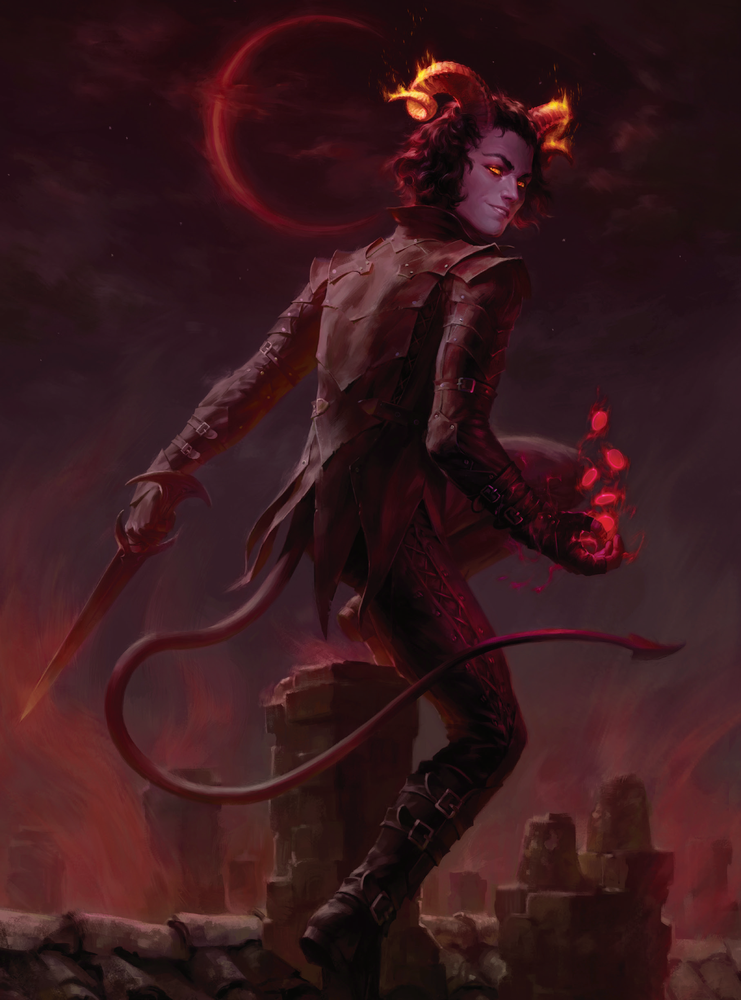

## **沃尔吉夫**

<center class="half">    
      
   
</center>


**剧情奖励**

- **独有装备/独有BUFF**：不接受力量则可以获得法袍<招摇撞骗>（运动检定+10，借机攻击+2AB）；接受恶魔力量变为红色立绘，则获得【恶魔起源】（+2智敏【亵渎】，变为异界生物类别，获得恶魔模板；代价是不能受到伟岸雄姿和缩小术的增益）

### 20奥法暴徒新加点

~~装备和玩法参考~~---[正义之怒主角BD---奥法暴徒](https://github.com/ZJUZBW/Wotr-BD-LR#奥法暴徒)

**升级顺序：**

20奥法暴徒

**属性加点：**

4敏，最后一点任意，可以加敏捷（诡计大师道途或灵使道途）或体质。

**技能加点：**

- 灵巧、巧手、隐匿、察觉、使用魔法装置；队伍里有聂纽，则使用魔法装置可以不用继续提高，而是优先点满神秘（做卷轴）或者世界（做饭）、根据队伍和主角定位来选择。

**玩法**：

- 第一章
  - 前期沃尔吉夫的一环记忆护盾术和缩小术对半（如果有奇数情况，优先护盾术、缩小术可以靠药水补），法师护甲就靠卷轴和药水，或者靠席拉前期兼职受诅巫师的法师护甲或者小烬的法师护甲。如果你让沃尔吉夫一环记忆法师护甲的话，续航太差了。
  - 2环基本上都可以记忆猫之迅捷，镜影术可以看情况记一个关键时刻使用（还有镜影术卷轴记得买）。极致利用法术位和道具，手动操作夹击敌人，沃尔吉夫前期的强度还行的。
  - 遇到有dr/寒铁的敌人，可以副手拿说话武器，主手用精制品匕首配合祝福武器药水，这样就不吃减伤。
  - 第一章小贼有33点AC（10+8敏调+1体型+4法师护甲+4护盾术+1加速术+2树肤+2虔诚护盾+1骨拳术）；有镜影术的情况下，只要不去当主T，基本上不太需要考虑生存问题了。6级打灰兵营的时候，AC有35点，当前排绰绰有余。
- 第二章
  - 神话1选择变化自如以后，靠2环法术动物形态触发变化自如的加成，这样小贼就会在6~7级拥有37点AC（10+10敏调+1体型+4法师护甲+4护盾术+1加速术+3树肤+3虔诚护盾+1骨拳术），在第二章的强度不容忽略了，第二章配合队友给的高等隐形术和自带的镜影术，可以说输出还行（常驻1d3+11+3d6偷袭骰，用识破命门打关键战役可以有5d6偷袭骰---新版本有法力珍珠，第三章配合低等延时超魔权杖就是全程续航了），自保能力也不错。
- 第三章
  - 新版本有锯齿刀这个强力敏系武器，沃尔吉夫的输出能力算是获得了极大提升，第三章在眷泽城的军需官处刚好可以买下锯齿刀<锯爪>和<现实报>，双持以后输出和辅助作用都很不错。
  - 现世报（放副手）：用现世报对新敌人发动整轮攻击时，使用该武器额外对敌人攻击一次
  - 锯爪（放主手）：类人生物破敌，持用者第二次用锯爪攻击命中使敌人措手不及一轮（这个能力保证了后续攻击命中，还能方便队友），持用者第三次用锯爪攻击命中会附带敏捷调整值的伤害（后续的锯爪攻击均会附带该伤害，就是相当于额外获得一倍的敏上伤）
- **20级神话9的输出**：
  - 单次攻击伤害 = 【1d6 + 27（+16锯爪+9常备不怠）】+【15d6 + 4d6×1.5（火焰易伤）】 ≈ 104 （+16+9）
    - 可重击部分 = 1d6武器骰 + 16敏捷调整值 + 4英雄祈神（士气） + 3启明星之戒 + 2召唤之戒 + 2破敌 （+16锯爪+9常备不怠）
    - 附伤 = 1d6突袭护腕 + 12d6偷袭骰 + 1d6火焰烙印 + 1d6巨灵化身（火焰）+2d6诡诈烈焰（火焰）+2d6圣战之刃
      - 注：这些附伤跟其他BD不同，都不会被减免的，因为有弱化创伤的降低dr效果（每级降低1点DR）。

  - 攻击链为：
    - 主手：BAB的4次（战法转换），加速术1次，机会主义者1次，杰作之锤2次
    - 副手：双武器战斗系列的3次，现世报1次
    - 共计10次攻击（算杰作之锤就是12次），轮伤害破千（不考虑包抄借机和重击），其中满BAB的攻击是5或7次，后续攻击有错乱之创等效额外8AB和锯爪的措手不及，命中率有保障。

  - 缺点是遇到免疫偷袭的敌人会比较刮痧（但是锯爪有额外附伤，比以前的匕首好多了），遇到护命的话还行。


**BD思路**：

DLC4以后，变化自如改动，以及新法术骨拳术的出现，小贼第二章强度增加了不少，玩法又有了新的思路，就是优先保证菜刀能力，后期再靠多余的超魔权杖实现魔武双修。

1. 敏双持的缺点触及范围太小，导致天生的生存能力低下（敌人容易转火）而且很难打出整轮攻击。这样敏双持要发力的话，就得先保证生存能力，然后才能考虑输出，跟特化输出的大力哥不是一个级别的输出效率，而且后期大力哥也可以有很高的AC。但是新版本有突刺，敏双持的弱势得到部分弥补，不再是以前那么惨了。
1. 因为AC数值跟难度有关，难度低了堆高了AC也没意义，而且为了堆AC而疯狂兼职之类反而会影响后期强度以及自BUFF续航。所以我个人认为小贼还是以保持满CL为主，纯职业最佳，困难难度或以下生存都不成问题。
1. 神话2之前小贼会离队，这个时候其实是小贼伤害起飞的时间（突刺+BAB6多一打+精通双武器战斗），但是AC基本保证不变，困难难度下这个AC配合突刺和镜影还是很能保证生存的，不公平难度下稍微注意一下也还行。
1. 第三章入队以后，13级神话4的节点，通过伟岸雄姿以后再缩小，沃尔吉夫的AC会有一个飞跃，达到58点（10+13敏调+1体型+8大法师护甲+4护盾术+1加速术+5树肤+4虔诚护盾+1骨拳术+6伟岸雄姿+1结界大师护符+2出双入对+1学徒法袍-2突刺+3盔甲增强）。
1. 20级神话9，不考虑道途的最终面板AC大概是75/82（10+16敏调+1体型+13大法师护甲+4护盾术/11护卫友伴+1加速术+5树肤+5虔诚护盾+1骨拳术+6伟岸雄姿+1结界大师护符+2出双入对+1学徒法袍-2突刺+3蜥蜴尾+1奈克隆的牺牲+5盔甲增强 +2预警术）。
1. ~~兼职的T向加点~~（好像游戏刚出不久就有这个BD思路了，B站上也有人介绍，就是新版本专长和神话加点需要修改），3奥法暴徒1受诅巫师16活体解剖师，这个兼职BD满级的AC会比纯职业高出 10顶级诱变剂 +4冻皮霜护 +3飞翼（对抗近战）
   1. 优势是后期可以给队友注入护盾术、战法转换、回声定位等法术，也有加树肤的能力。
   1. 代价是失去了群体次元门等回合制法术突脸能力，也没有射线法术了，流程中的物理输出也低了。在前中期BUFF续航时间完全断档（比如神话1的变化自如根本触发不了，还得8级才有动物之型），没有错乱之创等效AB反而低了，相当于一个加BUFF能力很差的副T。我个人觉得适合中后期空降（至少得第三章12级），神话点出双持久以后才能用得舒服。
   1. 前期没有神话位置出屹立不倒，那么也说不上是主T，AC再高也怕暴毙。身为一个不是主T的人，输出不是特别优秀，意志豁免和强韧豁免又太低，在不考虑主角的情况下，还得需要免疫心智的装备，这就跟队伍里的主输出位抢装备了。

**定位：掌握战略法术的自BUFF菜刀**
前期是自buff战士，也可以不加防御buff客串远程接触射线人（酸液球/雪球术、灼热射线、重挫冲击）、顺便削减敌人DR、元素抗性和AC。中后期靠瞬发权杖实现群体/单体次元门飞脸、瞬发克敌触发弱化创伤、~~射线补伤害~~等操作。

**专长选择：**

```
--20奥法暴徒（无甲腹卷版本）【2024.12.25日更新】-----------
1双武器战斗（自带）
2【游荡者天赋】：弱化创伤（自带）---这玩意有点厉害，不但能削DR，还能削各种能量抗性，小贼玩射线甚至不需要巅峰元素了
3双斩（自带）、【巧技训练】：匕首
4【弱化之创】（记得在能力栏里查看，共有三个能力，只能激活一个，优先激活错乱之创；有双重弱化后可以同时开启两个）
5熟练偷袭者
7包抄
8【游荡者天赋】：精通双武器战斗
9突刺
11异种武器擅长（锯齿刀）、【巧技训练】：锯齿刀
12【游荡者天赋】：机会主义者
13精通重击（锯齿刀）
15超魔（法术延时）
16【游荡者天赋】：倦惰打击（每次偷袭降1体质，效果为每两刀降低敌人HD的血量-包括当前血量和血量上限，约等于每刀多8伤害以上） /双重弱化（在能力栏里可以同时开启错乱之创和失向之创，等效于8AC）
17精通先攻
19高等双武器战斗、【巧技训练】：自选
20【游荡者天赋】：双重弱化 /倦惰打击
.
1变化自如（用自身二环的动物形态触发，获得额外+4力敏体）、2神话双武器战斗（等于+2AB,对于游荡者这种需要第一刀命中来触发错乱之创的职业比较重要）、3常备不怠/大法师护甲、4大法师护甲/常备不怠、5屹立不倒、6精通先攻（神话）、7偏好超魔（法术延时）、8神话精通重击、9引领打击、10

敏捷调整值：24+8增强+4餐食+2缩小术+4变化自如+2天赋+2其他（维勒西娅的项链） = 46（18）
【偷袭大师】：DC = 10+10（1/2职业等级）+18（敏调） = 38，某些道途敏调可以更高，DC可以到40左右（等效DC可以靠神使灵光和可怖外表等提高）
注意：20级的大招【偷袭大师】，是一个可以开关的能力，遇到DC不正确的情况，先关闭再激活即可。

【注：如果缺少DLC6假面舞会，就点不出异种武器擅长（锯齿刀），可以把11级专长换成技能检定（隐匿）或者额外游荡者特技：技能专家（隐匿），武器用匕首；精通重击用匕首；或者用百宝袋调出这个擅长，比如剑圣的自选武器，螳螂神的偏好武器等】

--20奥法暴徒（神话轻甲版本）【未完成】-----------
1双武器战斗（自带）
2【游荡者天赋】：弱化创伤（自带）---这玩意有点厉害，不但能削DR，还能削各种能量抗性，小贼玩射线甚至不需要巅峰元素了
3双斩（自带）、【巧技训练】：匕首
4【弱化之创】（记得在能力栏里查看，共有三个能力，只能激活一个，优先激活错乱之创；有双重弱化后可以同时开启两个）
5轻甲擅长
7包抄
8【游荡者天赋】：精通双武器战斗
9轻甲专攻
11异种武器擅长（锯齿刀）、【巧技训练】：锯齿刀
12【游荡者天赋】：机会主义者
13精通重击（锯齿刀）
15突刺
16【游荡者天赋】：精通先攻
17超魔（法术延时）
19高等双武器战斗、【巧技训练】：自选
20【游荡者天赋】：双重弱化 /倦惰打击 /披甲奥术训练
.
1变化自如、2神话盔甲专攻（轻甲强攻）、3大法师护甲、4神话精通重击、5常备不怠、6精通先攻（神话）、7偏好超魔（法术延时）、8神话盔甲专攻（轻甲回避）、9引领打击、10神话双武器战斗

敏捷调整值：24+8增强+4餐食+2缩小术+4变化自如+2天赋+2其他（维勒西娅的项链）+4亵渎（蛇皮甲） = 50（20）
【偷袭大师】：DC = 10+10（1/2职业等级）+20（敏调） = 40，某些道途敏调可以更高，等效DC可以靠神使灵光和可怖外表等提高
注意：20级的大招【偷袭大师】，是一个可以开关的能力，遇到DC不正确的情况，先关闭再激活即可。

==========神话轻甲BUG修复和结盟施法者改版前========================
--20奥法暴徒（纯肉搏转射线武器双修流)【2024.1.19日更新】-----------
1双武器战斗（自带）
2【游荡者天赋】：弱化创伤（自带）---这玩意有点厉害，不但能削DR，还能削各种能量抗性，小贼玩射线甚至不需要巅峰元素了
3双斩（自带）
5轻甲擅长
7包抄
8【游荡者天赋】：精通双武器战斗
9轻甲专攻
11突刺
12【游荡者天赋】：机会主义者
13超魔（法术延时）
15精通重击（匕首）
16【游荡者天赋】：精通先攻
17高等双武器战斗
19结盟施法者
20【游荡者天赋】：野兔魔宠

也可以选择17奥法暴徒3博学士，结盟施法者换成技能专攻（世界），扩表拿个神能，变成纯肉搏玩法。
==========DLC5版本之前===========================
--20奥法暴徒（纯肉搏向，即时制纯挂机流)【2023.3.15日更新】-----------
有突刺以后奥法暴徒会弥补部分短板，缩小以后也能有10尺触及，这样借机和打伤害都方便很多，要是有TTT的长臂咒就更好了。
1双武器战斗（自带）
2【游荡者天赋】：弱化创伤（自带）---这玩意有点厉害，不但能削DR，还能削各种能量抗性，小贼玩射线甚至不需要巅峰元素了
3双斩（自带）
5熟练偷袭者
7包抄
8【游荡者天赋】：精通双武器战斗
9突刺
11精通重击（匕首）
12【游荡者天赋】：机会主义者
13超魔（法术延时）
15精通先攻
16【游荡者天赋】：倦惰打击/野兔魔宠/可换
17高等双武器战斗
19奥术打击
20【游荡者天赋】：野兔魔宠

--16奥法暴徒4博学士（纯肉搏向，即时制纯挂机流)【2023.4.4日更新】-----------
有突刺以后奥法暴徒会弥补部分短板，缩小以后也能有10尺触及，这样借机和打伤害都方便很多，要是有TTT的长臂咒就更好了。
1双武器战斗（自带）
2【游荡者天赋】：弱化创伤（自带）---这玩意有点厉害，不但能削DR，还能削各种能量抗性，小贼玩射线甚至不需要巅峰元素了
3双斩（自带）
5熟练偷袭者
7包抄
8【游荡者天赋】：精通双武器战斗
9突刺
11精通重击（匕首）
12【游荡者天赋】：机会主义者
13超魔（法术延时）
15技能专攻（世界）
16【游荡者天赋】：野兔魔宠
17博学士：精通先攻、【战士专长】-高等双武器战斗/自选（想玩BUG可以去拿【游荡者天赋】-战斗特技的精通精通重击）
18博学士
19博学士：奥术打击、【牧师法术】-神能（后面是可以常驻神能的）
20博学士

两套BD的不同就是要不要这个大招秒杀，后期大概是有34DC的秒杀，其实还是很厉害的。
```

**巧计训练：**
3匕首、11短剑/细剑，19细剑/短剑

**神话专长和能力：**

神话能力：变化自如、常备不怠、引领打击、双持久、大法师护甲、偏好超魔（延时）

神话专长：神话盔甲专攻（轻甲强攻）、反应施术、精通先攻（神话）

**神话专长和能力的点法很多**，我这里只提供两种点法：

- 神话加点（即时制为主）：1变化自如、2神话双武器战斗、3大法师护甲、4常备不怠/引领打击、5屹立不倒/偏好超魔（法术延时）、6精通先攻（神话）、7持久法术、8神话精通重击、9高等持久法术、10
- ~~神话加点（回合制为主）：1变化自如、2神话双武器战斗、3大法师护甲、4反应施术、5屹立不倒、6精通先攻（神话）、7持久法术、8神话精通重击、9高等持久法术、10~~

1. 匕首：主手<搜猎仪之爪>/<慈悲命运>/<蝎刺>（升级版--拿着蝎刺击杀谜语人即可升级） + 副手<速杀>
1. ~~切换主副手武器来附魔祝福武器和圣战之刃~~。

**装备**：

可以参考爱露莎蕾的部分装备

- 头盔：风宗头盔，休息的时候带+4/6智力头
- 项链：先用风之气息，后面酌情考虑出双入对、+6天生防御护符、料敌护符等；
- 手套：第五章可换手套<送亡者>（偷袭骰+1），<诡诈烈焰>手套（这个是主C毕业装）
- 戒指：启明星之戒等
- 腰带：+6敏捷腰带，袭击者腰带，蜥蜴尾（搭配高奏凯歌之戒和隆奈克的牺牲，这样就是主C待遇）
- 靴子：精灵靴、奥法维持之靴、隆奈克的牺牲
- 护腕：突袭护腕、+N防御护腕（~~这个是搭配神话轻甲BUG的~~）、动物之怒护腕（变形效应以后+3AB和3伤害，这版本有BUG无条件叠加，AB不显示在战斗日志详细里，但是总值是加成了的）
- 法袍：学徒法袍
- 盔甲：神圣护卫卷腹等
- 眼镜：邪眼护命镜、奸徒眼镜
- 披风：剥皮斗篷/伪装斗篷，视隐匿检定来换；后面用<险隐>披风/<独狼>披风
- 物品栏：小魔鬼，

**关于奥法暴徒的伤害：**

原版游戏里的奥法暴徒是增强版的，4级的游荡者天赋换到2级，1级多一个偷袭骰。~~所以搭配识破命门和熟练偷袭者，奥法暴徒在前期可以相当于一个超级加强版游荡者，后期由于双持久+巨灵化身+元素狂潮的加成，更是远超游荡者~~。

- 如果都用+1武器

- 5级自buff的奥法暴徒，伤害就有1d3+9+3d6 ≈ 21.5，攻击2次或3次（加速术）。
- 5级力双手斩矛突变斗士，满buff+猛力攻击的伤害才2d8+23 ≈ 32，攻击1次或2次（加速术）或三次（终势斩）或更多（强力顺势斩+终势斩）。
- 对单体输出的能力差距不大。

**关于奥法暴徒的AB（不考虑武器差异）：**

- 4级奥法暴徒：3BAB+8敏+1体型+1士气（祝福术）-2双武器战斗 =11，错乱之创等效4AB（而且队友攻击受到错乱之创的敌人时，敌人的AC-2，等效于+2AB）
- 4级突变斗士：4BAB+10力-1体型+1士气（祝福术）-2猛力攻击+1武器专攻 =13，
- 5级奥法暴徒：3BAB+8敏+1体型+1士气（祝福术）-2双武器战斗 =11，错乱之创等效4AB（而且队友攻击受到错乱之创的敌人时，敌人的AC-2，等效于+2AB）
- 5级突变斗士：5BAB+10力-1体型+1士气（祝福术）-2猛力攻击+1武器专攻+1武器训练 +2包抄=17，

**游荡者只要给敌人挂上了错乱之创，那么它的AB还是非常合格的**

- 奥法暴徒后期独有AB等效为25 = 15BAB+8错乱之创+2变化自如；战法转换+5，根据玩法还有神话轻甲专攻（强攻）+9【没BUG的情况，目前可以到14+】
- 突变斗士后期独有AB等效为28 = 20BAB-6猛力攻击+6武器训练+4顶级诱变剂+4神话/高等武器专攻

**奥法暴徒法术选择（其实第二章以后都可以用卷轴来学习了）：**

```
护盾术、缩小术、法师护甲、脚底抹油、雪球术、变巨术、克敌机先（反应施术以后可以经常用或者提前用延时克敌）、油腻术
动物园系列（优先选猫之轻灵，然后根据队友配置来选）、动物之型、识破命门、镜影术、朦胧术、灼热射线、共用防护阵营、蛛网术
加速术、移位术、共用防护箭矢（可以防御集群伤害）、高等魔化武器、重挫冲击、解除魔法、英雄气概、共用抵抗能量、
高等隐形术、次元门、共用防护能量、高等动物之型（浣熊）、吸能术、延时恐惧术
回声定位、共用石肤、动物异变、维生气泡、巨灵化身、
战法转换、地狱烈焰射线、高等解除魔法、高等英雄气概、真知术、群体动物园系列
```
