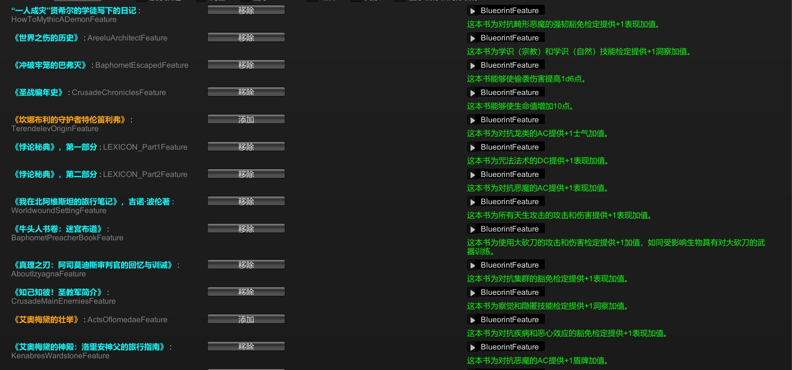
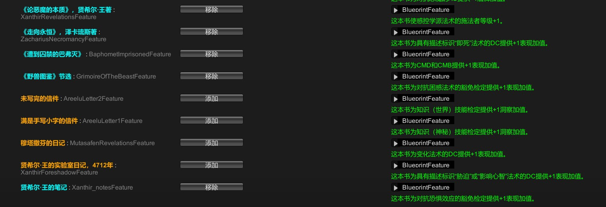

# 主角特有的书籍奖励

正义之怒的主角可以通过阅读游戏过程中捡到的书籍，获得额外的知识奖励。【注：打开书籍，翻到最后就行，战斗日志界面会显示获得知识】

数据来自百宝袋，共计23本书，目前已经全部实测 ---[百度贴吧](https://tieba.baidu.com/p/9392508405)

| 书籍名称                                   | 加成                                                         | 获取位置                                                     |
| ------------------------------------------ | ------------------------------------------------------------ | ------------------------------------------------------------ |
| 《牛头人书卷：迷宫布道》                   | 使用大砍刀的AB和伤害+1                                       | 序章盾牌迷宫                                                 |
| 《我在北阿维斯坦的旅行笔记》，吉诺·波伦著  | 天生武器攻击的AB和伤害+1【表现】                             | 第一章黑翼图书馆                                             |
| 《坎娜布利的守护者特伦笛利弗》             | 对抗龙类的AC+1【士气】                                       | 第一章黑翼图书馆                                             |
| 《真理之刃：阿司莫迪斯审判官的回忆与训诫》 | 对抗集群的豁免检定+1【表现】                                 | 第一章黑翼图书馆                                             |
| 《艾奥梅黛的神殿：洛里安神父的旅行指南》   | 对抗恶魔的AC+1【盾牌】                                       | 第一章黑翼图书馆                                             |
| 《走向永恒》，泽卡琉斯著                   | 拥有‘即死’描述符的法术DC+1【表现】                           | 第二章失陷教堂                                               |
| 《圣战编年史》                             | 生命值上限+10                                                | 第二章失陷教堂、第三章眷泽城的旅馆                           |
| 《世界之伤的历史》                         | 宗教和自然的技能检定+1【洞察】                               | 第二章失陷教堂、第三章眷泽城的神庙                           |
| 《知己知彼！圣教军简介》                   | 察觉和隐匿的技能检定+1【洞察】                               | 第二章失陷教堂                                               |
| 贤希尔·王的实验室日记，4712年              | 拥有‘胁迫’或者‘影响心智’描述符的法术DC+1【表现】             | 第二章眷泽要塞（灾劫巨口，门口旁边的桌子；老存档没有，新存档才有---必须新版本以后第一次进入眷泽要塞才有） |
| 《艾奥梅黛的壮举》                         | 对抗疾病和恶心效应的豁免检定+1【表现】                       | 第三章眷泽城的神庙                                           |
| 《遭到囚禁的巴弗灭》                       | CMB和CMD+1【表现】                                           | 第三章象牙迷堂                                               |
| 贤希尔·王的笔记                            | 对抗恐惧效应的豁免检定+1【表现】                             | 第三章象牙迷堂                                               |
| 《论恶魔的本质》，贤希尔·王著              | 惑控学派法术的CL+1                                           | 第三章象牙迷堂                                               |
| “一人成灾”贤希尔的学徒写下的日记           | 对抗畸形恶魔的强韧豁免检定+1【表现】                         | 第三章象牙迷堂                                               |
| 《悖论秘典》，第一部分                     | 咒法系法术DC+1【表现】                                       | 第三章阿瑞露的实验室                                         |
| 穆塔撒芬的日记                             | 变化系法术DC+1【表现】                                       | 第三章午夜神庙，御衡者道途，完成真正的御衡者任务才可获得。   |
| 《悖论秘典》，第二部分                     | 对抗恶魔的AC+1【表现】                                       | 第四章绸影宫                                                 |
| 未写完的信件                               | 世界的技能检定+1【洞察】                                     | 第四章绸影宫                                                 |
| 满是手写小字的信件                         | 神秘的技能检定+1【洞察】                                     | 第四章绸影宫                                                 |
| 《冲破牢笼的巴弗灭》                       | 偷袭伤害增加一个伤害骰（1d6），没有偷袭骰则不会生效          | 第五章无间囚狱                                               |
| 《野兽图鉴》节选                           | 对抗惑控法术的豁免检定+1【表现】                             | 第五章无间囚狱                                               |
| 《权力胜于法律》——墨菲斯托菲利斯           | 赋予你颁布【倾覆敕令】的能力：50英尺半径范围内的所有敌人受到你的每个神话阶层1d8点污邪伤害，并且必须进行强韧豁免检定，失败将会俯卧，并且再对自己和所有邻接敌人造成你的每个神话阶层1d8点污邪伤害。豁免DC等于10+你的角色等级+你的神话阶层+你的最高属性调整值。 | 第五章，魔鬼道途引诱高芙瑞堕落、背弃天堂之后由阿斯莫迪斯给与。 |

**百宝袋调取的数据如下**：

